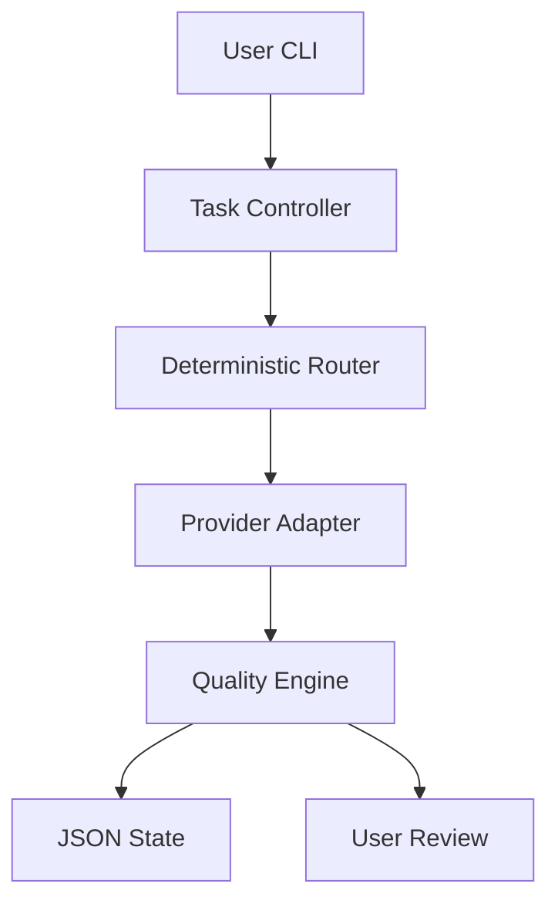

# Architecture

Flow:

The controller classifies tasks as `trivial`, `easy`, `medium`, `hard`, or `critical`.

Routing is deterministic:

- Easy/trivial CSS, docs, text, formatting tasks route to Groq unless overridden.
- Auth, password, database, payment, SQL, security and uncertain complex work route to Codex.
- `--provider` can force `codex`, `groq`, or `mock`.

Provider types:

- Model provider: returns text or a patch.
- Agent provider: can use files and tools in the selected working directory.

Safe mode uses a Git worktree. Fast mode never lets agent providers write directly to the main project directory; it executes them in a temporary copy and stores a per-task patch. Model providers store their returned patch as a task artifact.

Patch artifacts live under `.hybrid/tasks/<TASK-ID>/proposed.patch` and are hashed when created. `review` reads the task artifact. `apply --yes` rechecks the hash, protected paths, project cleanliness, and patch conflicts before changing files.

Security boundaries:

- Real mechanisms: Git worktree isolation for SAFE MODE, temporary copy execution for FAST agent providers, `git apply --check`, path resolution checks, symlink boundary checks, and refusal to apply over local changes.
- Program checks: forbidden path rules, context filtering, provider status validation, max changed file count, and syntax checks.
- Not provided: a full OS/filesystem sandbox for arbitrary untrusted commands.

